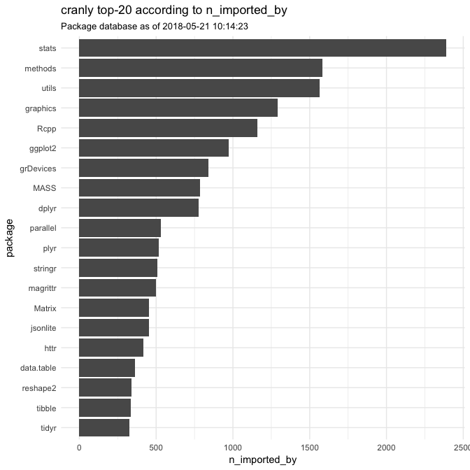
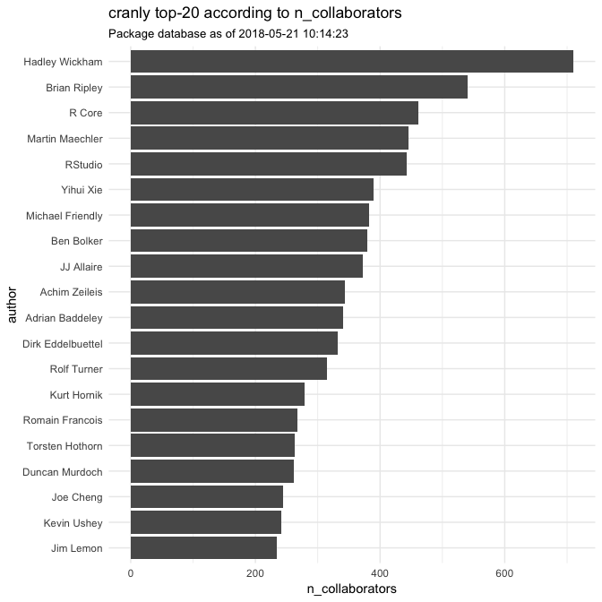
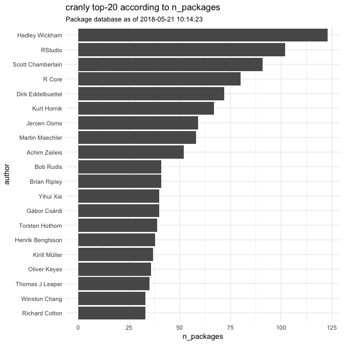
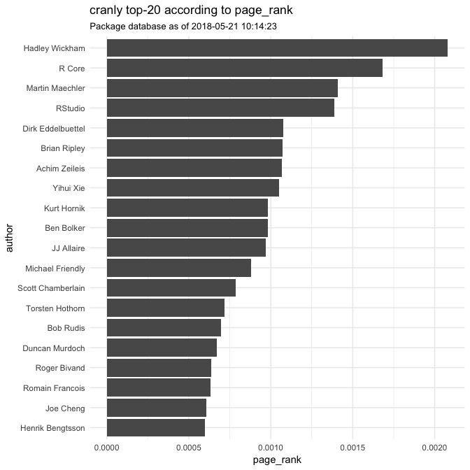

<!-- README.md is generated from README.Rmd. Please edit that file -->
[](https://travis-ci.org/ikosmidis/cranly)
[](https://codecov.io/github/ikosmidis/cranly?branch=master)

cranly
======

[**cranly**](https://github.com/ikosmidis/cranly) provides core
visualisations and summaries for the CRAN package database. It is aimed
mainly as an analytics tool for developers to keep track of their CRAN
packages and profiles, as well as those of others, which, at least for
me, is proving harder and harder with the rapid growth of the
[CRAN](https://cran.r-project.org) ecosystem.

The package provides comprehensive methods for cleaning up and
organising the information in the CRAN package database, for building
package directives networks (depends, imports, suggests, enhances) and
collaboration networks, and for computing summaries and producing
interactive visualisations from the resulting networks. Network
visualisation is through the
[**visNetwork**](https://CRAN.R-project.org/package=visNetwork) package.
The package also provides functions to coerce the networks to
[igraph](https://CRAN.R-project.org/package=igraph) objects for further
analyses and modelling.

### Installation

Install the development version from github:

``` r
# install.packages("devtools")
devtools::install_github("ikosmidis/cranly")
```

### Collaboration and package directives networks in CRAN

The first step in the **cranly** workflow is to try and “clean-up” the
package and author names in the data frame that results from a call to
`tools::CRAN_package_db()`

``` r
p_db <- tools::CRAN_package_db()
package_db <- clean_CRAN_db(p_db)
```

The CRAN database we use is from

``` r
attr(package_db, "timestamp")
#> [1] "2018-03-27 00:33:03 BST"
```

#### Package directives networks

The package directives network can then be built using

``` r
package_network <- build_network(package_db)
```

`package_network` can then be interrogated using extractor methods (see,
`?package_by`). For example, my packages can be extracted as follows

``` r
my_packages <- package_by(package_network, "Ioannis Kosmidis")
my_packages
#> [1] "betareg"      "brglm"        "brglm2"       "enrichwith"  
#> [5] "PlackettLuce" "profileModel" "trackeR"
```

and their sub-network of directives can be summarized in an interactive
visualization, a shapshot of which is below

``` r
visualize(package_network, package = my_packages, title = TRUE, legend = TRUE)
```


We can also compute package summaries and plot “Top-n” lists according
to the various summaries

``` r
package_summaries <- summary(package_network)
plot(package_summaries, according_to = "n_imported_by", top = 20)
```



``` r
plot(package_summaries, according_to = "page_rank", top = 20)
```


#### Collaboration networks

The collaboration network can also be built using a similar call

``` r
author_network <- build_network(package_db, perspective = "author")
```

and the extractor functions work exactly as they did for the package
directives network. For example, my collaboration network results can be
summarized as an interactive visualization, a shapshot of which is below

``` r
visualize(author_network, author = "Ioannis Kosmidis")
```


“Top-n” collaborators according to various summaries can again be
computed

``` r
author_summaries <- summary(author_network)
plot(author_summaries, according_to = "n_collaborators", top = 20)
```



``` r
plot(author_summaries, according_to = "n_packages", top = 20)
```



``` r
plot(author_summaries, according_to = "page_rank", top = 20)
```



Well, the usual suspects…

Check the package vignettes for a more comprehensive tour of the package
and for network visualisations on authors with orders of magnitude
larger collaboration networks than mine.
